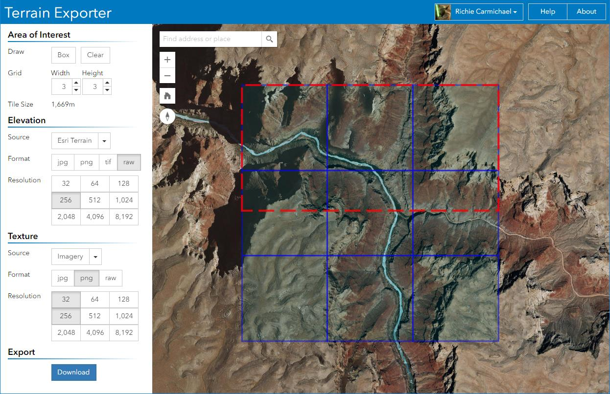

# Terrain Exporter

Terrain Exporter is a proof-of-concept developed to assist 3d designers with creating realistic scenes. The application creates texture and elevation files compatiable with most game engine terrains. We encourage you to watch the demonstration [walkthough](https://www.youtube.com/watch?v=ZxEc_ZKD7js).

The application was designed and developed by [Esri](https://www.esri.com/)'s [Applications Prototype Lab](https://maps.esri.com) in Redlands, California. The application was built using the following technologies:

- [ArcGIS API for JavaScript](https://developers.arcgis.com/javascript/) by [Esri](https://www.esri.com)
- [Bootstrap](http://getbootstrap.com/) by [Twitter Inc.](https://twitter.com/)
- [jQuery](http://jquery.com/) by the jQuery Foundation Inc.

This application requires an ArcGIS Online organization subscription or an ArcGIS Developer account but does not consume credits. If you don't have an account, you can sign up for a [free trial of ArcGIS](http://goto.arcgisonline.com/features/trial) or a [free ArcGIS Developer Account](http://goto.arcgisonline.com/developers/signup).

Please note that the use of ArcGIS Online content is subject to the Esri Master License Agreement. [View Summary](http://links.esri.com/tou_summary) | [View Terms of Use](http://links.esri.com/agol_tou)

